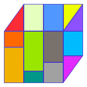

  
  
  # ColorLift - Landing Page
  
  
  
  

> **🏆 Landing page for ColorLift browser extension- Color palettes from Tailwind, Material, Radix, Nord and more — in HEX and RGB formats.**

Access popular design system colors like Material UI, Tailwind, Radix and Nord directly in your browser. Perfect for developers and designers working with Figma, VS Code, or any design tool. This repository contains the official landing page showcasing the extension's features and functionality.

### About

ColorLift is a **free, lightweight, and privacy-focused** browser extension designed for developers and designers who work with popular design systems. Get quick access to professionally curated color palettes without leaving your workflow - **no account required**.

### Features

- **Preloaded Presets** - Access curated palettes from popular systems like Tailwind, Material UI, Radix, Nord, and more
- **ColorPicker Tool** - Pick any color from your screen, whether it's inside your browser or anywhere on your desktop, with pixel-perfect precision
- **Favourites & Custom Palettes** - Save colors you love and build your own palettes for future projects
- **Copy in One Click** - Instantly copy color values in HEX or RGB formats to your clipboard
- **Drag and Drop** - Hold `Shift` + `Left Click` and drag the color to your VS Code, Figma or anywhere you like. No need to copy to your clipboard
- **Open Source** - Feel free to contribute or request a feature to this community-driven project

> **Have feedback or want a new feature?** Reach me at [heycolorlift@gmail.com](mailto:heycolorlift@gmail.com)

### Design Systems Supported

The landing page showcases support for these popular design systems:

- **Tailwind CSS** - 110+ colors across 11 color families
- **Material UI** - 280+ colors following Google's Material Design
- **Radix Colors** - 180+ colors optimized for accessibility
- **Nord** - 16+ arctic, north-bluish colors for elegant interfaces
- **Open Color** - 130+ colors for UI components
- **Flat UI Colors** - 40+ beautiful flat design colors

### Related Links

- **[🎨 ColorLift Extension Repository](https://github.com/SimranDev/color-lift)** - Extension codebase
- **[🏪 Chrome Web Store](https://chromewebstore.google.com/detail/colorlift/pdlbgfbmijdmejbmjababcdblgpipgdn)** - Install the extension
- **[🦊 Firefox Add-ons](http://addons.mozilla.org/en-US/firefox/addon/colorlift/)** - Firefox version (coming soon)
- **[📧 Contact Us](mailto:heycolorlift@gmail.com)** - Feedback and feature requests

### Extension Usage

Once installed, ColorLift provides multiple ways to work with colors:

1. **Browse Presets** - Click the extension icon to access curated color palettes
2. **Pick from Screen** - Use the color picker tool to sample any color on your screen
3. **Drag & Drop** - Hold `Shift` + `Left Click` and drag colors directly to your tools
4. **Copy & Paste** - One-click copying in HEX or RGB formats
5. **Save Favorites** - Build your personal collection of frequently used colors

### Inspiration

ColorLift was created to solve the common problem of constantly switching between documentation and development tools when working with design systems. By bringing popular color palettes directly to your browser, along with powerful features like screen color picking and drag & drop functionality, it help developers and designers maintain focus and improve productivity.

---

  
Built with ❤️ by <a href="https://github.com/SimranDev">SimranDev</a>

  
⭐ Star this repo if you find it helpful!

